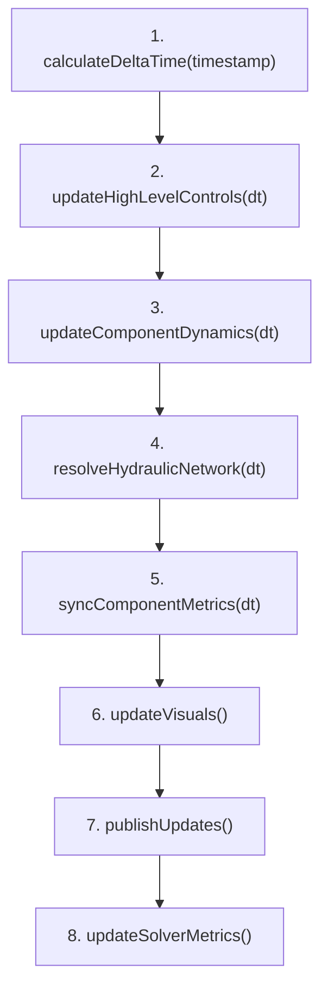

# Arquitetura Física e Computacional do Backend — GAAP Virtual Lab

Este documento descreve detalhadamente os princípios de engenharia química (hidrodinâmica e termodinâmica) e as estruturas de engenharia de software que governam o backend (camadas de **Domínio** e **Aplicação**) do GAAP Virtual Lab. O objetivo é fornecer uma referência técnica sólida e clara para futuros engenheiros que venham a manter ou expandir o código.

---

## 1. Visão Geral da Arquitetura do Backend

O simulador é projetado seguindo princípios de **Domain-Driven Design (DDD)** e **SOLID**, garantindo que as regras físicas e a orquestração do sistema estejam completamente isoladas de tecnologias de interface (DOM, SVG, Chart.js, etc.).

```text
  [ Camada de Apresentação / UI ] (controllers, presenters, i18n, DisplayUnits)
               │
               ▼
   [ Camada de Aplicação ] (SimulationEngine, SimulationTickPipeline, Stores, ConnectionService)
               │
               ▼
   [ Camada de Domínio ] (BaseComponente, Componentes Lógicos, Solver Hidráulico, PipeHydraulics)
```

### 1.1 Camada de Domínio (`js/domain/`)
Contém os modelos lógicos puros e equações matemáticas que descrevem o comportamento físico do sistema. **Regra rígida:** Esta camada não possui imports ou referências a elementos de tela (DOM), estilos ou bibliotecas de terceiros como Chart.js.
*   `components/`: Representações puras de equipamentos (Fontes, Bombas, Válvulas, Tanques, Trocadores, Drenos).
*   `services/`: Algoritmos de rede, como o solver hidráulico, diagnósticos de dimensionamento, cálculo de atrito de tubulações e o controlador PID.
*   `units/`: Constantes físicas globais e conversores internos de unidades.
*   `models/`: O modelo lógico de conexão (`ConnectionModel`).

### 1.2 Camada de Aplicação (`js/application/`)
Coordena o fluxo de execução, gerencia o estado global (Stores de seleção, conexões, topologia e configuração) e orquestra o ciclo da simulação.
*   `engine/SimulationEngine.js`: Ponto central de execução física e controle de ticks.
*   `engine/SimulationTickPipeline.js`: Gerencia a sequência lógica executada a cada frame do navegador.
*   `stores/`: Mantém estados de seleção, topologia de rede (`TopologyGraph`) e relaxamento transiente.

---

## 2. O Loop de Simulação (Tick Pipeline)

A simulação é conduzida sob demanda do navegador por meio de `requestAnimationFrame` em um pipeline dinâmico estruturado em `SimulationTickPipeline.js`. O passo de tempo interativo $dt$ é calculado dinamicamente com base no tempo real decorrido entre os frames, limitado a um teto numérico de segurança:

$$dt = \text{clamp}\left(\frac{t_{\text{atual}} - t_{\text{anterior}}}{1000} \cdot \text{velocidade}, \; 0, \; 0.1\right) \quad \text{[segundos]}$$

A limitação a $0.1\text{ s}$ impede divergências ou "explosões" numéricas caso o navegador sofra uma queda repentina de desempenho ou se a aba seja pausada temporariamente pelo sistema operacional.

O pipeline de execução do tick ocorre na seguinte ordem seqüencial:



1.  **`calculateDeltaTime(timestamp)`**: Calcula e limita o $dt$ do frame corrente.
2.  **`updateHighLevelControls(dt)`**: Executa o controlador de nível (PID) dos tanques antes da resolução física da rede. A saída do controle modula a abertura das válvulas, influenciando diretamente a hidráulica a ser resolvida.
3.  **`updateComponentDynamics(dt)`**: Aplica dinâmicas físicas transientes de equipamentos, tais como o avanço da rampa de rotação de bombas e o tempo de curso de posicionamento de válvulas.
4.  **`resolveHydraulicNetwork(dt)`**: Invoca o solver hidráulico para propagar pressões, vazões e propriedades físicas dos fluidos ao longo de toda a rede lógica.
5.  **`syncComponentMetrics(dt)`**: Sincroniza estados internos finais de conservação de massa e integra variáveis dinâmicas acumuladas (ex: inventário volumétrico do tanque, tempo de residência).
6.  **`updateVisuals()`**: Atualiza estados visuais do DOM e de portas na camada de infraestrutura.
7.  **`publishUpdates()`**: Dispara eventos de atualização da aplicação para atualizar painéis de propriedades e séries temporais de monitoramento.
8.  **`updateSolverMetrics()`**: Atualiza os contadores internos de performance do solver para monitorar convergência.

---

## 3. Equações Hidráulicas e Modelos Físicos

O GAAP Virtual Lab opera sob uma modelagem física unidimensional e pseudo-estacionária para redes hidráulicas de fluidos incompressíveis, aplicando as leis de conservação de massa e energia.

As unidades internas padronizadas do motor hidráulico são:
*   **Vazão ($Q$):** Litros por segundo ($\text{L/s}$)
*   **Pressão ($P$):** bar ($\text{1 bar} = 10^5\text{ Pa}$)
*   **Comprimento ($L$) e Diâmetro ($D$):** Metros ($\text{m}$)
*   **Volume ($V$):** Litros ($\text{L}$)
*   **Temperatura ($T$):** Graus Celsius ($^\circ\text{C}$)

---

### 3.1 Equação de Continuidade e Velocidade de Escoamento
A vazão volumétrica $Q$ convertida para metros cúbicos por segundo ($\text{m}^3\text{/s}$) é relacionada com a área transversal da tubulação $A$ e a velocidade média de escoamento $v$ por:

$$Q = v \cdot A$$

$$A = \frac{\pi \cdot D^2}{4}$$

$$v = \frac{Q_{\text{m}^3\text{/s}}}{A}$$

A partir dessa relação, o sistema pode dimensionar e sugerir o diâmetro da tubulação $D_{\text{sugerido}}$ para uma velocidade de projeto recomendada $v_{\text{projeto}}$ (padrão $2.0\text{ m/s}$):

$$D_{\text{sugerido}} = \sqrt{\frac{4 \cdot Q_{\text{m}^3\text{/s}}}{\pi \cdot v_{\text{projeto}}}}$$

---

### 3.2 Escoamento de Fluidos e Número de Reynolds
O número de Reynolds ($Re$) classifica o comportamento hidrodinâmico do fluido na tubulação:

$$Re = \frac{\rho \cdot v \cdot D}{\mu}$$

Onde:
*   $\rho$ é a densidade do fluido ($\text{kg/m}^3$).
*   $\mu$ é a viscosidade dinâmica do fluido ($\text{Pa}\cdot\text{s}$ ou $\text{kg/(m}\cdot\text{s)}$).
*   $D$ é o diâmetro interno do tubo ($\text{m}$).

**Classificação do Regime no Simulador:**
*   $Re \le 2300$: **Laminar** (escoamento ordenado por forças viscosas).
*   $2300 < Re < 4000$: **Regime de Transição** (interpolação numérica).
*   $Re \ge 4000$: **Turbulento** (escoamento dominado por forças inerciais e vórtices).

---

### 3.3 Fator de Atrito de Darcy
O cálculo do fator de atrito ($f$) é implementado em `PipeHydraulics.js` e varia de acordo com o regime de escoamento:

#### Regime Laminar ($Re \le 2300$)
É utilizada a equação clássica derivada da lei de Poiseuille:

$$f = \frac{64}{Re}$$

#### Regime Turbulento ($Re \ge 4000$)
É calculada a aproximação explícita de **Swamee-Jain** para a equação implícita de Colebrook-White:

$$f = \frac{0.25}{\left[ \log_{10} \left( \frac{\varepsilon}{3.7 \cdot D} + \frac{5.74}{Re^{0.9}} \right) \right]^2}$$

Onde $\varepsilon$ é a rugosidade absoluta da tubulação ($\text{m}$).

#### Regime de Transição ($2300 < Re < 4000$)
Para evitar descontinuidades numéricas que desestabilizariam o solver, o simulador faz uma interpolação linear suave dos coeficientes de atrito calculados para os extremos da faixa ($f_{\text{laminar}}(2300)$ e $f_{\text{turbulento}}(4000)$):

$$f = (1 - t) \cdot f_{\text{laminar}} + t \cdot f_{\text{turbulento}} \quad \text{onde } t = \frac{Re - 2300}{4000 - 2300}$$

Em todos os casos, o fator de atrito resultante é limitado por segurança a uma faixa física realista: $f \in [0.008, \; 0.15]$.

---

### 3.5 Perdas de Carga Hidráulica (Darcy-Weisbach e Bernoulli)
A queda de pressão total $\Delta P$ em uma tubulação é a soma da perda de carga distribuída (atrito viscoso ao longo das paredes) e perdas de carga locais (acessórios, curvas, reduções):

$$\Delta P_{\text{tubulação}} = \Delta P_{\text{distribuída}} + \Delta P_{\text{local}}$$

#### Perda Distribuída (Darcy-Weisbach)
Representada como um coeficiente de perda equivalente adimensional:

$$K_{\text{distribuído}} = f \cdot \frac{L_{\text{total}}}{D}$$

Onde $L_{\text{total}} = L_{\text{esquemático}} + L_{\text{extra}}$. Em modo sem altura relativa, $L_{\text{esquemático}}$ é fixado didaticamente em $1\text{ m}$.

#### Perda Localizada
Calculada a partir do coeficiente local adimensional de perda da conexão $K_{\text{local}}$ (configurado nas propriedades avançadas do cano):

$$\Delta P = \frac{1}{2} \cdot \rho \cdot K_{\text{adimensional}} \cdot v^2$$

#### Correção por Viscosidade e Reynolds Baixo
Para fluidos viscosos ou velocidades muito baixas, os coeficientes de perda de carga local ($K_{\text{local}}$, perda de saída do tanque, etc.) sofrem uma penalização corretiva baseada no Reynolds para modelar o aumento da resistência viscosa em regimes não-turbulentos:

$$f_{\text{corr}} = \text{clamp}\left(1 + \frac{120}{\sqrt{\max(Re, 1)}} \cdot \left(1 + 0.18 \cdot \log_{10}\left(\frac{\mu}{\mu_{\text{água}}}\right)\right), \; 1, \; 4\right)$$

$$K_{\text{corrigido}} = K_{\text{base}} \cdot f_{\text{corr}}$$

#### Relação Vazão vs Queda de Pressão (Bernoulli Simplificado)
Para estimar a vazão transitória a partir de um $\Delta P$ disponível ou vice-versa, o solver utiliza:

$$v = \sqrt{\frac{2 \cdot \Delta P_{\text{Pa}}}{\rho \cdot K_{\text{total}}}}$$

$$\Delta P_{\text{bar}} = \frac{\frac{1}{2} \cdot \rho \cdot K_{\text{total}} \cdot v^2}{10^5}$$

---

## 4. Equipamentos e Componentes do Processo

Cada equipamento na pasta `components/` implementa comportamentos de fronteira ou alterações na energia do fluido.

### 4.1 Bomba Centrífuga (`BombaLogica.js`)
Modelada a partir de sua curva de carga quadrática e o grau de acionamento efetivo da rotação ($\omega_{\text{ef}} \in [0, 1]$):

#### Curva de Carga (Head)
A pressão fornecida pela bomba a uma vazão $Q$ é calculada por:

$$H(Q) = H_{\text{máx}} \cdot \omega_{\text{ef}}^2 \cdot \left(1 - \left(\frac{Q}{Q_{\text{nominal}} \cdot \omega_{\text{ef}}}\right)^2\right) \quad \text{[bar]}$$

A bomba parada ($\omega_{\text{ef}} = 0$) atua como uma barreira hidráulica ideal, impedindo passagens passivas de vazão.

#### Eficiência Hidráulica
Calculada por uma curva parabólica em torno do ponto de melhor eficiência (BEP - *Best Efficiency Point*, configurado por padrão em $72\%$ da vazão nominal para a rotação atual):

$$\eta(Q) = \eta_{\text{nominal}} \cdot \left( 1 - 0.32 \cdot \left(\frac{Q - Q_{\text{BEP}}}{Q_{\text{BEP}}}\right)^2 \right)$$

#### Potência Hidráulica
A energia líquida transmitida ao fluido na descarga é:

$$P_{\text{hidráulica}} = Q_{\text{m}^3\text{/s}} \cdot \Delta P_{\text{Pa}} \quad \text{[Watts]}$$

A potência mecânica consumida no eixo da bomba é:

$$P_{\text{eixo}} = \frac{P_{\text{hidráulica}}}{\eta(Q)}$$

#### NPSH (Net Positive Suction Head) e Cavitação
O NPSH disponível no flange de sucção ($NPSH_{\text{a}}$) é avaliado considerando a carga de pressão manométrica absoluta, a pressão de vapor do fluido na temperatura local e a carga cinética:

$$NPSH_{\text{a}} = \frac{P_{\text{sucção, abs}} - P_{\text{vapor}}}{\rho \cdot g} + \frac{v_{\text{sucção}}^2}{2 \cdot g} \quad \text{[metros]}$$

O NPSH requerido ($NPSH_{\text{r}}$) cresce com o quadrado da vazão de sucção:

$$NPSH_{\text{r}}(Q) = NPSH_{\text{r, base}} \cdot \omega_{\text{ef}}^2 \cdot \left( 0.42 + 0.58 \cdot \left(\frac{Q}{Q_{\text{nominal}} \cdot \omega_{\text{ef}}}\right)^{1.8} \right) \quad \text{[metros]}$$

Se $NPSH_{\text{a}} < NPSH_{\text{r}}$, inicia-se a degradação de desempenho por **fator de cavitação** ($f_{\text{cav}}$), que atua reduzindo multiplicativamente a curva de pressão produzida:

$$f_{\text{cav}} = \text{clamp}\left( \left(\frac{NPSH_{\text{a}}}{NPSH_{\text{r}}}\right)^{1.7}, \; 0, \; 1 \right)$$

$$H(Q)_{\text{efetivo}} = H(Q) \cdot f_{\text{cav}}$$

---

### 4.2 Válvulas de Controle e Bloqueio (`ValvulaLogica.js`)
As válvulas operam estrangulando o escoamento, convertendo a abertura em restrição de área e perda de carga local equivalente.

#### Abertura Dinâmica
O acionador físico responde ao sinal de comando com um atraso de rampa de primeira ordem definido por `tempoCursoSegundos`.

#### Coeficientes Cv e Kv
O simulador utiliza a equivalência de vazão industrial regulada pela norma IEC 60534:

$$Kv = 0.8649786 \cdot Cv$$

$$Q_{\text{gpm}} = Cv \cdot \sqrt{\frac{\Delta P_{\text{psi}}}{SG}} \quad \implies \quad Q_{\text{m}^3\text{/h}} = Kv \cdot \sqrt{\Delta P_{\text{bar}} \cdot \frac{\rho_{\text{água}}}{\rho}}$$

A partir do $Cv$ efetivo na abertura atual, a válvula é convertida internamente para um coeficiente de perda de carga localizado adimensional ($K_{\text{válvula}}$) com base no diâmetro do flange da válvula $d_{\text{válvula}}$:

$$K_{\text{válvula}} = \frac{\rho_{\text{água}}}{\rho} \cdot \frac{d_{\text{válvula}}^4 \cdot \pi^2}{8 \cdot (Cv \cdot C_{\text{conv}})^2 \cdot 1000}$$

Onde $C_{\text{conv}}$ é a constante de conversão dimensional interna para converter as unidades da fórmula para o SI. Com abertura de $100\%$ e $Cv$ elevado, $K_{\text{válvula}}$ se aproxima de zero. Abertura efetiva igual a $0.0\%$ zera o $Cv$ e impõe $K_{\text{válvula}} = 10^6$ (bloqueio hidráulico ideal).

#### Características Inerentes da Válvula
A fração de vazão máxima ($f(x)$) em função da abertura fracionária ($x \in [0, 1]$) depende do perfil selecionado:

| Perfil | Equação Hidráulica $f(x)$ | Aplicação Típica em Processos |
|---|---|---|
| **Linear** | $f(x) = x$ | Controle de nível simples e malhas rápidas |
| **Equal Percentage** (Igual Perc.) | $f(x) = R^{(x - 1)}$ | Controle de pressão, vazão e trocadores de calor |
| **Abertura Rápida** | $f(x) = \sqrt{x}$ | Válvulas de alívio de segurança e bloqueio (on/off) |

Onde $R$ é a rangeabilidade inerente da válvula (padrão $50.0$). O $Cv$ efetivo é:

$$Cv_{\text{efetivo}} = Cv_{\text{máximo}} \cdot f(x)$$

---

### 4.3 Tanques de Armazenamento e Balanço de Massa (`TanqueLogico.js`)
O tanque armazena inventário volumétrico e calcula a carga hidrostática estática.

#### Pressão Hidrostática no Fundo
A pressão exercida na saída do bocal de fundo é:

$$P_{\text{hidrostática}} = \frac{\rho \cdot g \cdot h_{\text{líquido}}}{10^5} \quad \text{[bar]}$$

Onde $h_{\text{líquido}} = \left(\frac{V_{\text{atual}}}{V_{\text{máx}}}\right) \cdot H_{\text{útil}}$ representa a altura de líquido instantânea.

#### Balanço Dinâmico de Inventário
A cada tick, o volume é integrado numericamente:

$$\frac{dV}{dt} = \sum Q_{\text{entradas}} - \sum Q_{\text{saídas}}$$

$$V_{\text{novo}} = \text{clamp}(V_{\text{anterior}} + (Q_{\text{in}} - Q_{\text{out}}) \cdot dt, \; 0, \; V_{\text{máx}})$$

#### Tempo de Residência
O tempo de residência hidráulico médio ($\tau$) é calculado pela relação de volume útil e vazão volumétrica de saída estacionária:

$$\tau = \frac{V_{\text{atual}}}{Q_{\text{saída}}}$$

Caso a vazão de saída seja nula, o cálculo adota a vazão de entrada como base de renovação.

---

### 4.4 Mistura de Fluidos e Transientes Térmicos (`Fluido.js`)
Quando múltiplos fluidos se unem em nós de convergência (bifurcações reversas) ou dentro do tanque, o backend realiza balanços conservativos para atualizar as propriedades físicas médias resultantes.

#### Mistura de Densidades (Média Volumétrica)
A densidade média da mistura $\rho_{\text{mix}}$ assume volume ideal de mistura:

$$\rho_{\text{mix}} = \frac{\sum (Q_i \cdot \rho_i)}{\sum Q_i}$$

#### Mistura de Viscosidades (Modelo Logarítmico de Arrhenius)
A viscosidade dinâmica não segue uma mistura aritmética simples, visto que pequenas frações de fluidos de alta viscosidade afetam drasticamente a mistura. Aplica-se a média ponderada de Arrhenius:

$$\ln(\mu_{\text{mix}}) = \sum \left( \frac{Q_i}{\sum Q} \cdot \ln(\mu_i) \right) \quad \implies \quad \mu_{\text{mix}} = e^{\sum x_i \cdot \ln(\mu_i)}$$

#### Mistura de Temperaturas (Balanço de Energia Entálpico)
Assumindo calor sensível ideal sem reação química associada:

$$T_{\text{mix}} = \frac{\sum (Q_i \cdot \rho_i \cdot Cp_i \cdot T_i)}{\sum (Q_i \cdot \rho_i \cdot Cp_i)}$$

Onde $Cp_i$ é o calor específico do fluido na entrada $i$ ($\text{J/(kg}\cdot\text{K)}$).

---

### 4.5 Trocador de Calor (`TrocadorCalorLogico.js`)
Modelado a partir do método de **Efetividade - NTU (Número de Unidades de Transferência)**, assumindo um trocador de calor onde um dos fluidos (utilidade térmica) possui vazão mássica virtualmente infinita (temperatura de serviço constante, $T_{\text{serviço}}$):

#### Capacidade Térmica do Escoamento
$$C = \dot{m} \cdot Cp = \left(Q_{\text{m}^3\text{/s}} \cdot \rho\right) \cdot Cp \quad \text{[W/K]}$$

#### Número de Unidades de Transferência (NTU)
$$NTU = \frac{UA}{C}$$

Onde $UA$ é o coeficiente global de transferência de calor multiplicado pela área de troca ($\text{W/K}$).

#### Efetividade Térmica ($\varepsilon$)
$$\varepsilon = 1 - e^{-NTU}$$

A efetividade instantânea do trocador é limitada à efetividade máxima física do componente (padrão $95\%$).

#### Temperatura de Saída do Fluido e Carga Térmica
$$T_{\text{saída}} = T_{\text{entrada}} + \varepsilon \cdot (T_{\text{serviço}} - T_{\text{entrada}})$$

$$Q_{\text{térmico}} = C \cdot (T_{\text{saída}} - T_{\text{entrada}}) \quad \text{[Watts]}$$

---

### 4.6 Controlador de Nível PID (`LevelController.js`)
Os tanques contam com controladores de nível PID discretos que calculam ações corretivas a cada tick sobre válvulas de controle atuadoras:

#### Erro Normalizado
O erro de controle $e(t)$ é normalizado em relação à altura útil para manter os ganhos independentes das dimensões do tanque:

$$e(t) = \frac{SP - L_{\text{nível}}}{H_{\text{útil}}} \quad \in [-1, \; 1]$$

#### Equação do Sinal de Controle
O sinal de saída calculado $u(t)$ é a soma clássica das parcelas Proporcional, Integral e Derivativa:

$$u(t) = K_p \cdot e(t) + K_i \cdot \int_{0}^{t} e(\tau)d\tau + K_d \cdot \frac{de(t)}{dt}$$

*   **Anti-Windup (Clamping):** A parcela integral acumulada é congelada caso o atuador atinja os limites físicos de abertura total ou fechamento total ($u(t) \notin [0, 1]$), evitando instabilidade oscilatória após saturação.
*   **Ganhos Padrão do Lab:** Reescalados para erro normalizado ($K_p = 4.0$, $K_i = 0.6$, $K_d = 0.0$ - efetivamente um controlador **PI** estável e suave).

---

## 5. Algoritmo do Solver Hidráulico (Push-Based Solver)

O solver em `HydraulicNetworkSolver.js` opera resolvendo localmente as pressões e estimando fluxos que são propagados sequencialmente a partir de emissores primários (Fontes e Tanques com inventário).

### 5.1 Processo de Visita Nodal por Fila
O solver utiliza um percurso push-based orientado a filas com controle de visitas por componente (limite de $8$ visitas por nó para prevenir loops em circuitos complexos ou retropropagações infinitas):

1.  Enfileira todas as `FonteLogica` da planta.
2.  Enfileira todos os `TanqueLogico` contendo líquido.
3.  Processa a fila: para cada componente, constrói seu estado de suprimento (`buildSupplyState`), contendo pressão disponível e vazão máxima remanescente.
4.  Identifica as conexões de saída ativas desse componente.
5.  Para cada ramo de saída, estima a capacidade de vazão associada (`estimateBranch`).
6.  Distribui proporcionalmente a vazão total do componente de origem conforme as capacidades relativas dos ramos receptores.
7.  Aplica o fluxo relaxado no ramo (`applyBranchFlow`) e enfileira o componente de destino se ele for um pass-through ativo (Bomba, Válvula, Trocador).

---

### 5.2 Relaxamento Dinâmico de Fluxo
Para estabilizar transientes e evitar saltos abruptos de vazão entre passos, as conexões não assumem instantaneamente a vazão de equilíbrio estacionário resolvida pelo solver ($Q_{\text{estacionária}}$). O fluxo transiente ($Q_{\text{transiente}}$) é suavizado por uma dinâmica de primeira ordem governada pela inércia hidráulica do ramo:

$$\tau_{\text{resposta}} = \text{getConnectionResponseTimeS}(L_{\text{tubo}}, \; \rho, \; \mu)$$

$$Q_{\text{transiente}}^{t + dt} = Q_{\text{transiente}}^{t} + (Q_{\text{estacionária}} - Q_{\text{transiente}}^{t}) \cdot \left(1 - e^{-dt / \tau_{\text{resposta}}}\right)$$

---

### 5.3 Conservação de Massa em Componentes Passantes (Pass-Through)
Componentes pass-through lógicos (Válvulas, Bombas e Trocadores de Calor) não acumulam inventário. Portanto, o solver impõe estritamente:

$$Q_{\text{entrada}} = Q_{\text{saída}}$$

Ao final de cada tick de simulação, o método `balancePassThroughMass()` é executado. Ele percorre a rede de jusante para montante e, caso detecte um desbalanceamento volumétrico $\Delta Q = Q_{\text{in}} - Q_{\text{out}} > 0.0001\text{ L/s}$ (causado por restrições a jusante, como uma válvula fechando), ele reduz proporcionalmente a vazão das conexões de entrada do componente até que a conservação seja plenamente satisfeita.

---

## 6. Validação e Comparação com Outros Simuladores

Os resultados do GAAP Virtual Lab podem ser validados e comparados com simuladores comerciais de processos químicos (como DWSIM ou Aspen Plus). É essencial compreender as premissas adotadas por cada plataforma para realizar comparações coerentes.

### 6.1 Diferenças de Modelagem

| Característica | GAAP Virtual Lab | DWSIM / Aspen Plus |
|---|---|---|
| **Regime de Simulação** | Dinâmico/Transiente (relaxamento de fluxo de 1ª ordem, integração de tanques por Euler). | Estacionário (cálculo de balanço de pressões e vazões instantâneo). |
| **Balanço Hidráulico** | Solver local iterativo (push-based com retropropagação transiente). | Solver global simultâneo (sistemas de equações não lineares acopladas via Newton-Raphson). |
| **Separabilidade de Perdas** | Perdas de canos e perdas de componentes passantes (válvulas, trocadores) são tratadas de forma totalmente isolada. | Perdas de carga de válvulas e conexões podem ser aglutinadas em trechos hidráulicos. |

### 6.2 Diretrizes de Comparação
Para comparar a perda de carga de uma tubulação simples com o DWSIM (tratado como um segmento de tubo reto - *Straight Tube*):
1.  **Isolar Perdas de Acessórios:** Não misturar perdas locais de válvulas ou trocadores no mesmo trecho.
2.  **Utilizar o Termo Canônico do Cano:** Consultar o campo `pipePressureDropBar` ("Queda de pressão no Cano") exibido no painel e na exportação tabular. Esse campo considera puramente a perda por atrito distribuído de Darcy-Weisbach e a perda local configurada no próprio Cano ($K_{\text{local}}$), sem acumular as quedas térmicas ou de válvulas adjacentes.
3.  **Habilitar Altura Relativa:** Caso o cenário contenha desníveis geométricos, certifique-se de que a opção de altura relativa esteja ativada em ambas as ferramentas para balancear o termo de pressão hidrostática estática.

### 6.3 Exportação DWSIM CurveSet
Para facilitar testes cruzados de bombas industriais, o simulador permite exportar a curva de operação da bomba selecionada em um formato JSON padronizado lido pela biblioteca de curvas de bombas do DWSIM (*CurveSet*). Os dados exportados contêm arrays de pontos estruturados:
*   Vazão em metros cúbicos por segundo ($\text{m}^3\text{/s}$).
*   Carga hidráulica em metros de coluna de fluido ($\text{m}$).
*   Potência mecânica no eixo em kilowatts ($\text{kW}$).
*   Eficiência em termos percentuais ($\%$, ex: $78.0$).
